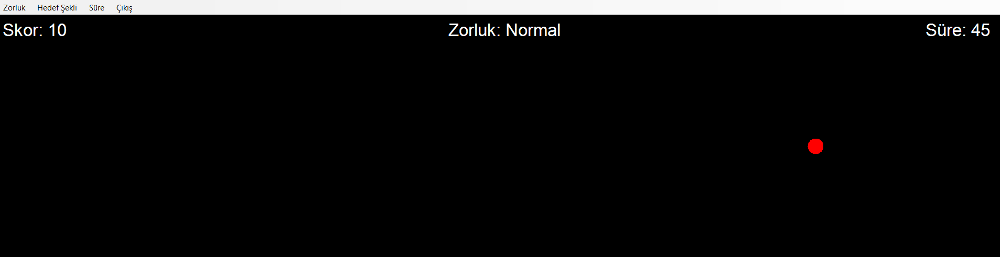

# Aim Training Uygulaması

Bu uygulama, fare kontrol becerilerinizi geliştirmenize yardımcı olan bir aim training (nişan alma) oyunudur.

## Özellikler

- Farklı zorluk seviyeleri (Kolay, Normal, Zor)
- Farklı hedef şekilleri (Daire, Kare, Üçgen)
- Ayarlanabilir oyun süresi (30, 60, 90 saniye)
- Gerçek zamanlı skor takibi
- Tam ekran modu
- Crosshair (nişangah) imleci

## Nasıl Oynanır

1. Menüden istediğiniz ayarları seçin:
   - Zorluk seviyesi
   - Hedef şekli
   - Oyun süresi

2. Ekrana tıklayarak oyunu başlatın

3. Ekranda beliren hedeflere tıklayarak puan kazanın

4. Süre dolduğunda oyun biter ve skorunuz gösterilir

## Kontroller

- ESC tuşu: Oyunu kapatır
- Menü seçenekleri: Oyun ayarlarını değiştirir

## Zorluk Seviyeleri

- **Kolay**: Büyük hedefler (40 piksel)
- **Normal**: Orta boy hedefler (30 piksel)
- **Zor**: Küçük hedefler (20 piksel)

## Hedef Şekilleri

- Daire
- Kare
- Üçgen

## Gereksinimler

- Windows İşletim Sistemi
- .NET Framework
- Visual Studio (derleme için)

## Kurulum

1. Projeyi bilgisayarınıza indirin
2. Visual Studio ile açın
3. F5 tuşuna basarak derleyin ve çalıştırın

## Geliştirici

Bu proje C# ve Windows Forms kullanılarak geliştirilmiştir.

